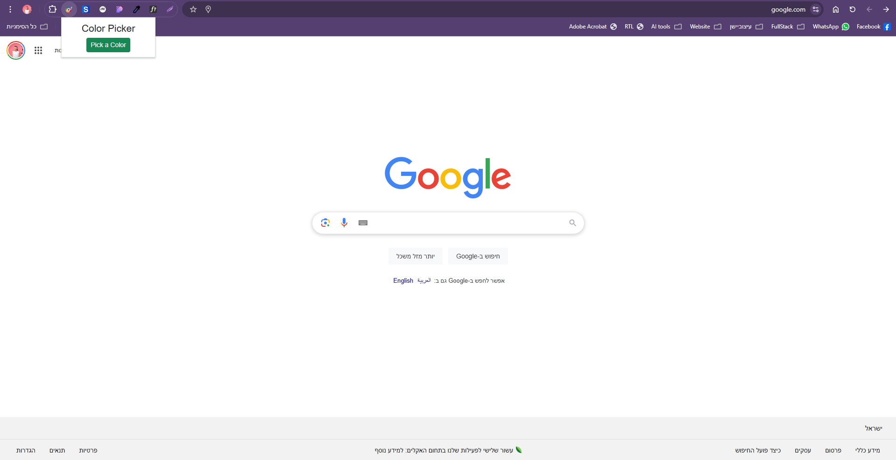
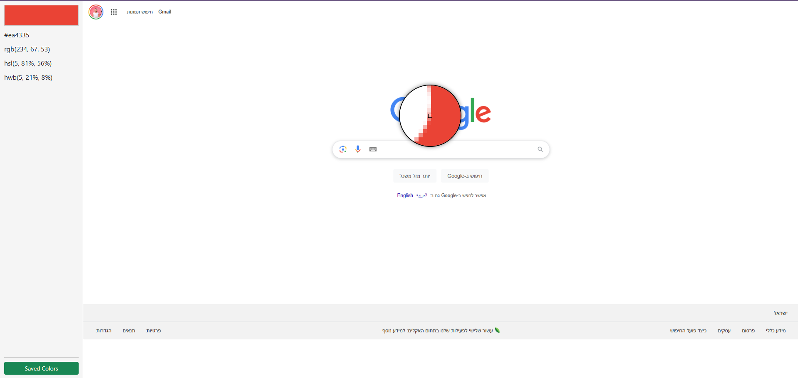

# Pick a Color - Chrome Extension

## Overview

Pick a Color is a Chrome extension designed to help you sample colors directly from websites and explore various shades and complementary colors. The tool is particularly useful for designers, developers, or anyone looking to enhance their color palette when working on projects.

This project was built as part of a web development course, inspired by the need for a convenient tool to sample and reuse colors from websites.

---

## Features

- **Color Sampling**: Easily sample colors from any website.
- **Color Details**: Get HEX, RGB, and HSL codes for the sampled color.
- **Color Variations**:
  - Darker shades
  - Lighter shades
  - Complementary colors
- **Save and View**: Save favorite colors and access them later.
- **Simple Interface**: Intuitive UI for quick and easy use.

---

## How It Works

1. **Activate the Extension**: While browsing a website, click the Pick a Color extension icon.
2. **Pick a Color**: In the popup, click the "Pick a Color" button.
3. **Sample Colors**: A new Chrome tab opens with a screenshot of the website, allowing you to sample the desired color by clicking on it.
4. **Explore Options**:
   - View darker and lighter shades of the selected color.
   - Explore complementary colors.
5. **Save Your Colors**: Save the selected colors for future reference.

### Screenshots

_Add screenshots of the extension in action here:_

1. **Popup Interface**
   
2. **Color Sampling Tab - Before selection**
   
3. **Color Sampling Tab - After selection**
   
4. **Saved Colors View**
   

---

## Technologies Used

- **JavaScript**: Core functionality and logic.
- **HTML**: Structuring the UI.
- **CSS**: Styling the extension interface.

---

## Installation Guide

To install and use the Pick a Color extension in Chrome:

1. **Download the Extension**: Clone or download this repository to your local machine.
2. **Open Chrome Extensions Settings**:
   - Navigate to `chrome://extensions/` in your browser.
3. **Enable Developer Mode**:
   - Toggle the "Developer mode" switch in the top right corner.
4. **Load the Extension**:
   - Click "Load unpacked" and select the folder containing the extension files.
5. **Activate**:
   - The Pick a Color extension should now appear in your Chrome toolbar.

---

## Usage

1. Browse to a website with a color you like.
2. Click the Pick a Color extension icon.
3. Follow the instructions in the popup to sample and save your colors.
4. Access saved colors anytime by clicking the extension icon again.

---

## License

This project is licensed under the MIT License.

---

## Credits

Developed by Daniel Zegerson. Inspired by the need for a practical color-sampling tool during web development projects.

```

```
